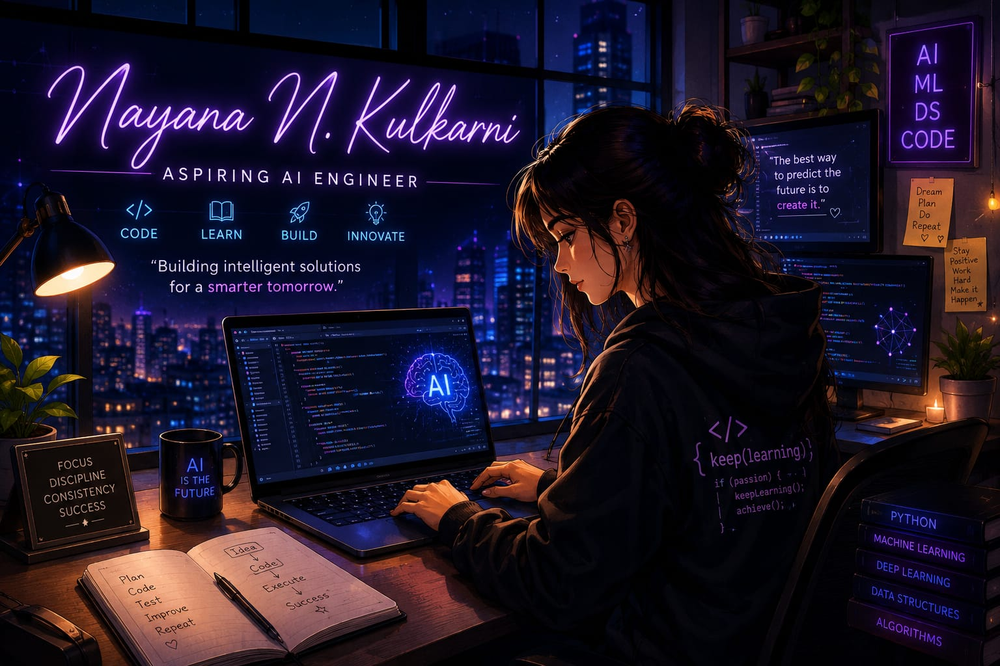

<h1 align="center">
Hi  I'm Nayana.N.Kulkarni
</h1>

  

  

  

- 🎓 Final Year B.E. in Information Science & Engineering
- 🌱 Currently Learning Machine Learning, AI & Full-Stack Development
- 💡 Passionate about AI, Python, Java and Software Development
- 📍 Davangere, Karnataka, India
- 📫 Email: **nayanank51@gmail.com**
- 🔗 LinkedIn: https://linkedin.com/in/nayana-n-kulkarni-09394b290

---

## 🚀 Tech Stack
 

  

  

---

## 🚀 Projects

- 📝 Customer Review Intelligence
- 🎤 AI Voice Assistant
- 🤖 AI Career Parser, Resume Analyzer & Interview Platform
- ⚖️ BMI Calculator
- 🏥 AI Healthcare Chatbot
- 🌊 LifeBridge AI – Emergency & Disaster Assistant
- 🌐 Portfolio Website

---

## 📊 GitHub Stats

  

  

---

## 🔥 GitHub Streak

  

---

## 🌐 Connect With Me

  
  
  

---

⭐ **Thanks for visiting my GitHub Profile!**
